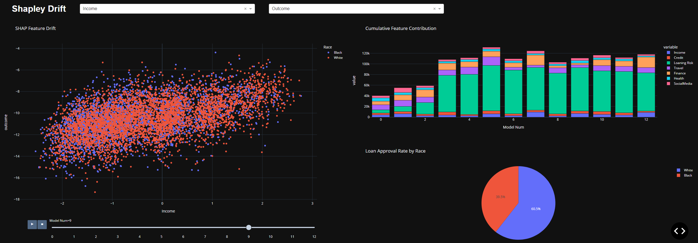

# Data-Drift Detection
A data-visualization dashboard combating implicit bias in machine learning models. By visualizing the change in <em>output</em> as a function of training iterations, 
one can detect (visually and statistically) unexpected data-shifts called <em>drift</em>. Drift is caused by the infinitely many variables that implicitly affect 
real-world data. Detecting drift combats said bias by exposing flaws that may not have been considered in model development. Additionally, our application detects 
feature-drift, thereby pinpointing the source(s) of bias.

[<b>Codefest 2022 Submission</b>](https://devpost.com/software/drift-cp84no)

Contributors:
- Eyasu Woldu
- Lincoln Mcloud
- Chase Gormley
- Kevin Bacon
- Likhon Gomes

## Screenshots -

---

---

---

